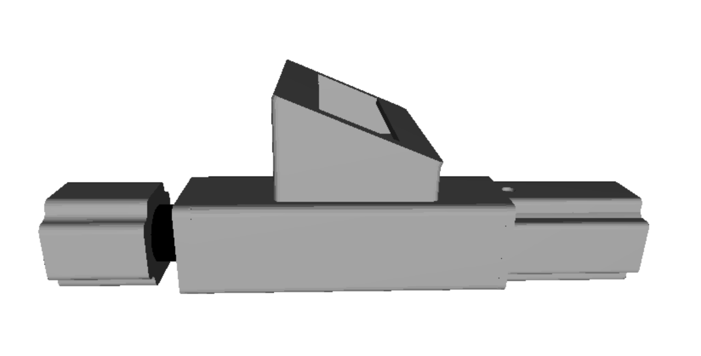

# JALSHUDDHI — Open Source River-Water Purification & Monitoring System

> A low-cost, repairable, inline water purifier with built-in water-quality
> monitoring (pH · TDS · turbidity · temperature), designed for households
> that depend on river or canal water where no piped supply exists.

| | |
|---|---|
| **Creator / Responsible party** | Sayaan Mehta |
| **Mentor** | Satyam Prakash |
| **Country of origin** | India |
| **Project version** | 1.0.0 |
| **Primary category** | Environmental |
| **Additional category** | Science / Education |
| **Hardware licence** | CERN-OHL-S v2.0 |
| **Software licence** | MIT |
| **Documentation licence** | CC BY-SA 4.0 |
| **OSHWA UID** | _to be assigned on certification (format `INxxxxxx`)_ |

> ⚠️ Placeholders to replace before publishing: the public contact email, the
> repository URL, and the OSHWA UID (assigned automatically when the
> application is approved).

---

## 1. Why this exists

Across India, millions of households without a piped connection draw their
drinking water from rivers and canals. In Karnal (Haryana) — the project's
reference location — municipal records show that of **116,051 assessed
properties only 40,957 hold a legal water connection**, leaving roughly
**64.7%** of properties without an authorised piped supply. In peripheral
areas the groundwater is saline, so families fall back on Yamuna-fed canal
water for everyday use. Globally, the WHO/UNICEF estimate that **1 in 3 people
lack safely managed drinking water**.

JALSHUDDHI is an attempt to put a transparent, buildable, and openly licensed
purification + monitoring unit into those hands — one that not only cleans the
water but *shows the user whether the result is safe to drink*.

## 2. What it does

Raw water is drawn from the source and passed through a multi-stage train,
disinfected with UV, and released only when the on-board sensors confirm the
output is within a safe drinking-water window.

**Filtration train**

```
Submersible Pump → Screen Filter → Pre-Filter → Sediment → Pre-Carbon
   → Post-Carbon → Solenoid Valve → Booster Pump → UF Membrane → UV Chamber → Clean outlet
```

**Monitoring subsystem** — an ESP32 reads pH, TDS, turbidity and temperature,
temperature-compensates the pH/TDS values, shows live readings on an LCD, and
runs the purification cycle through a safety state machine. If any parameter
is out of range the unit diverts to waste and displays a warning instead of
dispensing.

## 3. Physical layout



The enclosure is a modular inline body with four sections:

1. **Sensor mounting chamber** — houses the TDS and pH probes (and the
   turbidity + temperature sensors).
2. **Filtration system** — the central body holding the cartridge stack.
3. **Pump** — booster pump section.
4. **ESP32 + display module** — the angled head holding the controller, LCD
   and user button.

## 4. Repository structure

```
jalshuddhi/
├── README.md                      ← this file (documentation hub)
├── LICENSE                        ← MIT licence (software)
├── firmware/
│   └── jalshuddhi_firmware.ino    ← ESP32 monitoring + control firmware
├── hardware/
│   ├── device_render.png          ← enclosure render
│   ├── bom.csv                    ← bill of materials
│   ├── wiring.md                  ← pin map + wiring notes
│   └── cad/                       ← ▸ ADD: original CAD source (.step/.f3d) + .stl
└── docs/
    ├── assembly.md                ← ▸ ADD: step-by-step build with photos
    └── calibration.md             ← ▸ ADD: sensor calibration procedure
```

Items marked **▸ ADD** are the design files you still need to drop into the
repository so the documentation is complete for certification (see §7).

## 5. Bill of materials

The full BOM is in [`hardware/bom.csv`](hardware/bom.csv). Summary:

| Subsystem | Key parts |
|---|---|
| Filtration | Screen filter, pre-filter, sediment + pre-carbon + post-carbon cartridges, UF membrane, UV lamp kit |
| Fluid control | Submersible pump, booster pump, solenoid valve, pipe + push-fit connectors |
| Sensing | Analog pH probe, analog TDS probe, turbidity sensor, DS18B20 temperature probe |
| Electronics | ESP32 DevKit, 16×2 I²C LCD, 4-channel relay board, 24 V adapter + buck converter |
| Enclosure | 3D-printed modular housing (CAD in `hardware/cad/`) |

## 6. Build & flash (firmware)

1. Install the **Arduino IDE** and the **ESP32 board package**
   (`esp32` by Espressif via Boards Manager).
2. Install libraries via Library Manager: **OneWire**, **DallasTemperature**,
   **LiquidCrystal_I2C**.
3. Open `firmware/jalshuddhi_firmware.ino`, select your ESP32 board, and flash.
4. Wire the modules per [`hardware/wiring.md`](hardware/wiring.md).
5. **Calibrate** the pH and TDS probes before field use (see top-of-file notes
   and `docs/calibration.md`).

## 7. Licensing (Open Source Hardware)

This project is certified under the OSHWA programme, which requires every part
under the creator's control to be openly licensed:

- **Hardware** (enclosure CAD, wiring design): **CERN-OHL-S v2.0** —
  a strongly-reciprocal open hardware licence. A simpler alternative accepted
  by OSHWA is **CC BY-SA 4.0**.
- **Software** (firmware): **MIT** — permissive; see [`LICENSE`](LICENSE).
- **Documentation** (this README, assembly guide, diagrams): **CC BY-SA 4.0**.

> Note on third-party modules: the ESP32, sensor breakout boards, pumps, UV
> lamp and cartridges are off-the-shelf components outside the creator's
> control. OSHWA does not require these to be opened, but their datasheets must
> be publicly accessible. The **creator's contribution** — the enclosure
> design, the system integration, the wiring and the firmware — is fully open.

## 8. Safety

Mains-powered pumps, a UV-C lamp and water share one enclosure. Use an
opto-isolated relay board, fully shroud the UV lamp (UV-C harms eyes and skin),
enclose and fuse all mains wiring, and never run the unit with the enclosure
open. The firmware and hardware are provided **without warranty**.

## 9. Credits

Built by **Sayaan Mehta** with mentorship from **Satyam Prakash**. Background
and motivation draw on the maker's community work through the **Vikas
Foundation**.
